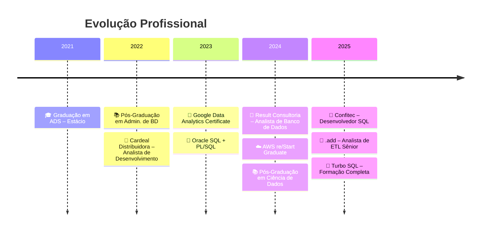

<div align="center">

<!-- Header animado com typing SVG -->
<a href="https://git.io/typing-svg"></a>

<br/>

<!-- Badges de contato -->
[](https://www.linkedin.com/in/vanderlandio-rocha/)
[](mailto:vanderlandio.zr@gmail.com)
[](https://github.com/vandorocha)

<br/>


</div>

---

## 🧑‍💻 Sobre mim

Especialista em Banco de Dados e ETL com experiência em ambientes críticos, atuando com SQL Server, PostgreSQL e Oracle. 
Meu trabalho envolve modelagem e otimização de bases, criação e sustentação de pipelines de carga (SSIS, Pentaho), desenvolvimento de procedures, views e triggers de alta complexidade, além de dashboards estratégicos em Power BI que impactam diretamente decisões de negócio.

Tenho vivência sólida em integração de sistemas corporativos (ERPs, WMS, APIs) e automação de processos com Python e C#, com entregas que reduziram tempo de ingestão de dados em até 95% e aumentaram a produtividade de equipes em 20%.

Atualmente, estudo Engenharia de Dados em nuvem (Databricks, Spark, AWS) e desenvolvimento web (JavaScript, Node.js, HTML/CSS, Java), expandindo meu stack para arquiteturas modernas e soluções cloud-native.

```text
🏢  Atualmente    →  Analista de ETL Sênior na .add (pipelines SRO/SUSEP)
📍  Localização   →  São Caetano – PE, Brasil
🎓  Formação      →  2x Pós-Graduação (Ciência de Dados & Administração de BD)
🚀  Foco atual    →  Engenharia de Dados | Cloud | Desenvolvimento Web
📚  Estudando     →  Arquiteturas em nuvem, APIs RESTful, Front-end moderno
```

---

## 🏆 Resultados & Impacto

<div align="center">

| 🔧 Entrega | 📈 Resultado |
|:---|:---|
| Reestruturação de pipelines PostgreSQL + Pentaho | **↓ 95%** no tempo de ingestão de dados |
| Redesenho de APIs em Spark/Databricks | Eliminação de falhas críticas em relatórios |
| Dashboards estratégicos (Power BI & TOTVS FA) | **↑ 20%** na produtividade do time de vendas |
| Automações com Python e C# | **↓ 30%** no tempo de rotinas críticas |
| Sustentação de cargas SSIS/SQL Server | Conformidade regulatória SUSEP garantida |

</div>

---

## ⚙️ Tech Stack

<div align="center">

### 🗄️ Bancos de Dados & ETL


### 📊 BI & Visualização


### 💻 Linguagens & Desenvolvimento


### ☁️ Cloud & Ferramentas


</div>

---

## 📜 Certificações

<div align="center">

| Certificação | Ano |
|:---|:---:|
| 🏅 Turbo SQL – Formação Completa em SQL Server | 2025 |
| 🏅 AWS re/Start Graduate – Escola da Nuvem | 2024 |
| 🏅 Google Data Analytics Professional Certificate | 2023 |
| 🏅 Microsoft Power BI para BI e Data Science – DSA | 2023 |
| 🏅 Oracle SQL + PL/SQL + Modelagem – Udemy | 2023 |
| 🏅 Ciências de Dados com Python – DIO | 2023 |

</div>

---

## 📈 GitHub Stats

<div align="center">

[](https://git.io/streak-stats)

</div>

---

## 🚀 Projetos em Destaque

<!-- 
  ⚠️ IMPORTANTE: Atualize os links abaixo com seus repositórios reais.
  Se o repo não existir publicamente, o card ainda funciona (diferente dos pin cards).
-->

<div align="center">
<table>
<tr>
<td width="50%" valign="top">

### 📊 [Análise de Dados com SQL](https://github.com/vandorocha/projeto-analise-sql)
Consultas avançadas, dashboards e relatórios de BI com foco em performance e insights estratégicos.

`SQL` `T-SQL` `Power BI`

</td>
<td width="50%" valign="top">

### 💻 [Sistema de Gestão Web](https://github.com/vandorocha/sistema-gestao-web)
Desenvolvimento full-stack para gerenciamento corporativo com interface moderna.

`JavaScript` `Node.js` `HTML/CSS`

</td>
</tr>
<tr>
<td width="50%" valign="top">

### 🔗 [API de Microserviços](https://github.com/vandorocha/api-microservices)
Integração de sistemas e serviços RESTful com arquitetura escalável.

`Python` `REST API` `Node.js`

</td>
<td width="50%" valign="top">

### 📈 [Dashboard de BI](https://github.com/vandorocha/dashboard-bi)
Visualizações interativas e insights estratégicos a partir de dados reais.

`Power BI` `SQL` `Python`

</td>
</tr>
</table>
</div>

---

## 📊 Atividade Recente

<div align="center">

[](https://github.com/vandorocha)

</div>

---

## 🗺️ Trajetória Profissional



---

<div align="center">

### 💬 Vamos conversar?

Estou sempre aberto a trocar ideias sobre **Engenharia de Dados**, **Banco de Dados**, **Desenvolvimento Web** e **novas tecnologias**.

<br/>

[](https://www.linkedin.com/in/vanderlandio-rocha/)
[](mailto:vanderlandio.zr@gmail.com)

<br/>


</div>
